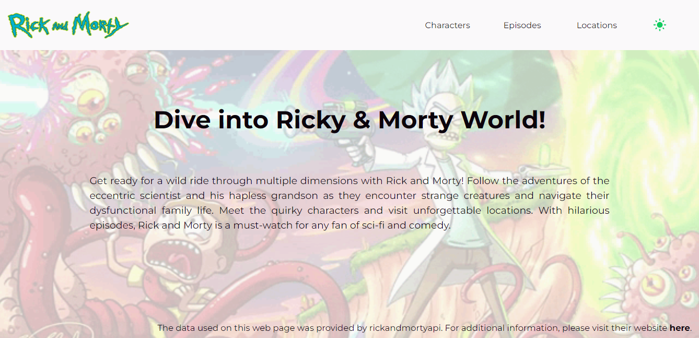
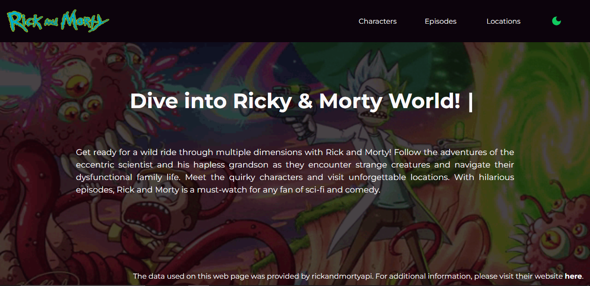
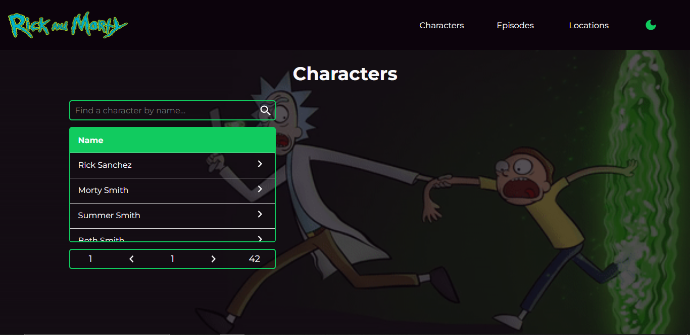
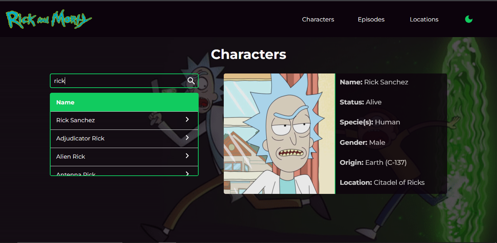
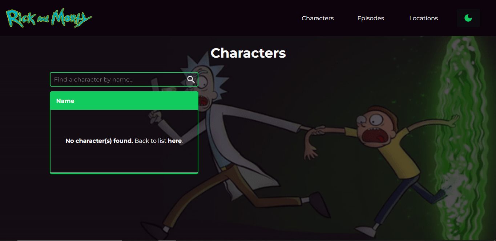
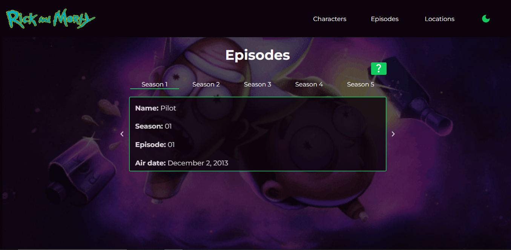
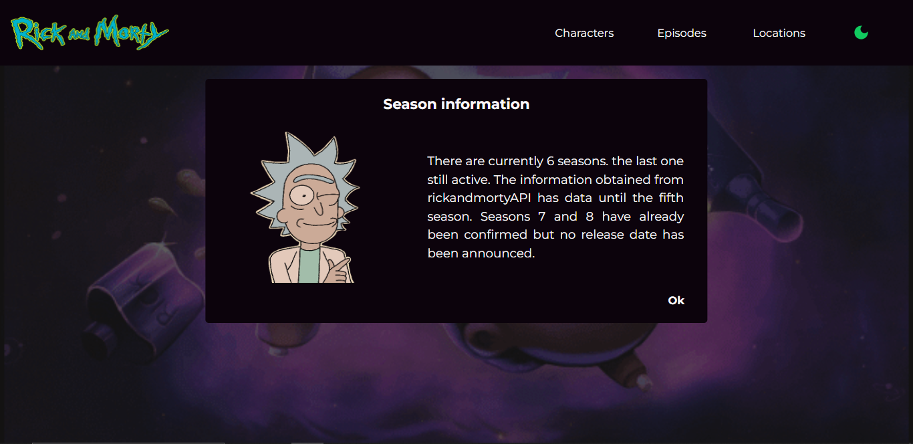
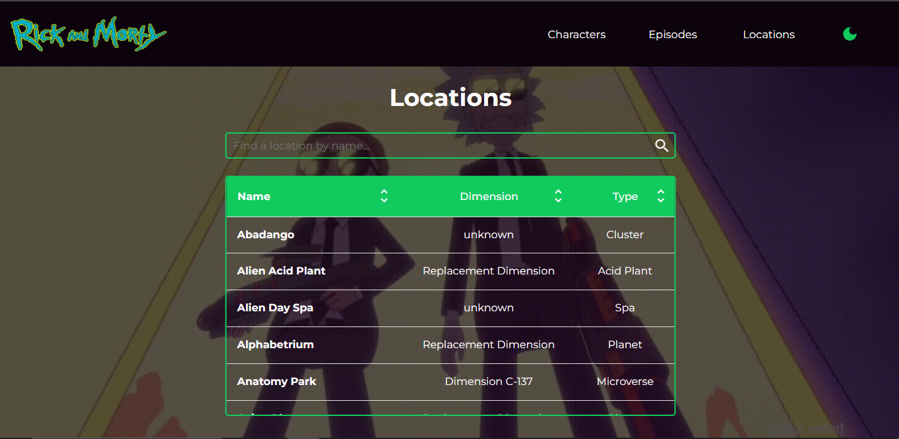
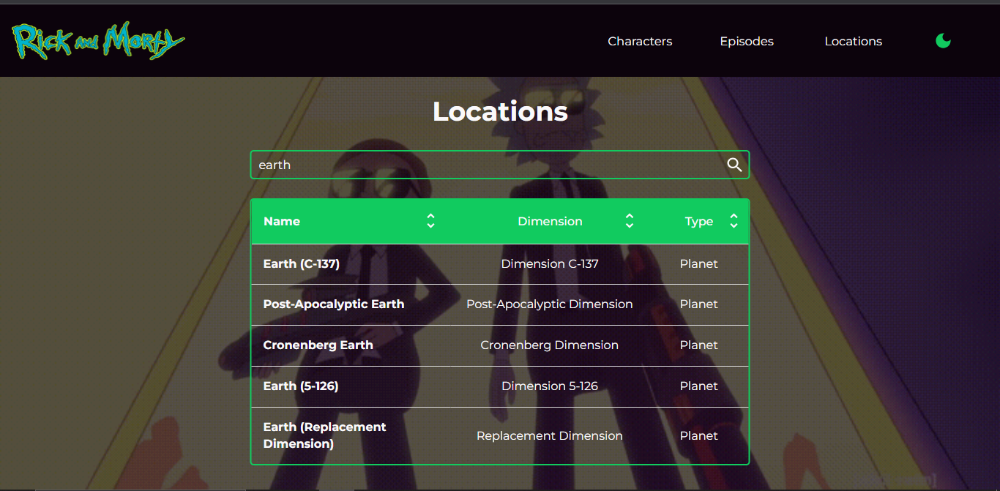

# The Rick and Morty API

### The application developed in React consumes data from rickandmortyapi.com. The application aims to show information about Characters, locals, and guides of episodes and seasons of the Rick and Morty series.

## Frontend setup
To install the dependencies, go to folder rickandmorty and run: ``` npm i ```

## Usage
The web page has 3 main sections, one to show all characters seen in all episodes, another to show all episodes from each season, and all different locals shown in the series.

## Application images
<span>The application landing page shows a brief text about the series and what you going to find on the web page. On the header is possible to see the theme button switch and three more buttons to redirect to the respective section. On the footer, there is a link that redirects to API where the data are retrieved.</span>

<span>Here is the application using the light theme:</span>

  
  
<span>Here is the application using the dark theme:</span>

  

  <span>By default, all other images on this readme file contain the application using the dark theme.</span>
  
  <span> In the character section, there is a table that contains all characters retrieved by the API.</span>
  
  
  
  <span>Also in this section is possible that the user searches for a character by name in the input field. The image below "simulates" a user search with the name "rick". It is possible to observe that when a character is clicked on the table, opens a container that has information about that character selected, like; "Name", "Status", "Specie", "Gender", "Origin" and "Location". </span>
  
  

  <span> In case the user searches for a character that not exists, the table shows the information that the character not exists and suggests that the user back to the list (initial state).</span>

  

  <span>In the Episodes section the users can navigate through the seasons and the episodes to see information about them.<span/>
  
  

  <span>Case users click on the "Interrogation button" it will open a modal with more information about the episodes e seasons data retrieved.</span>
  
  

  <span>In the Locations section there is a large table with all locations present in series, with columns; "Name", "Dimension" and "Type". It is possible to order by "asc" and "desc" each attribute column.<span/>
  
  

  <span>Also in this section is possible that the user searches for a location by name in the input field. The image below "simulates" a user search with the location "earth".<span/>
  
  
